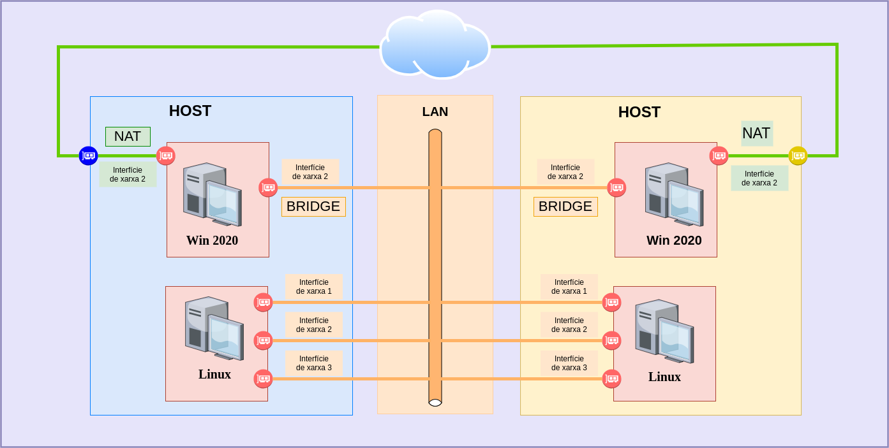
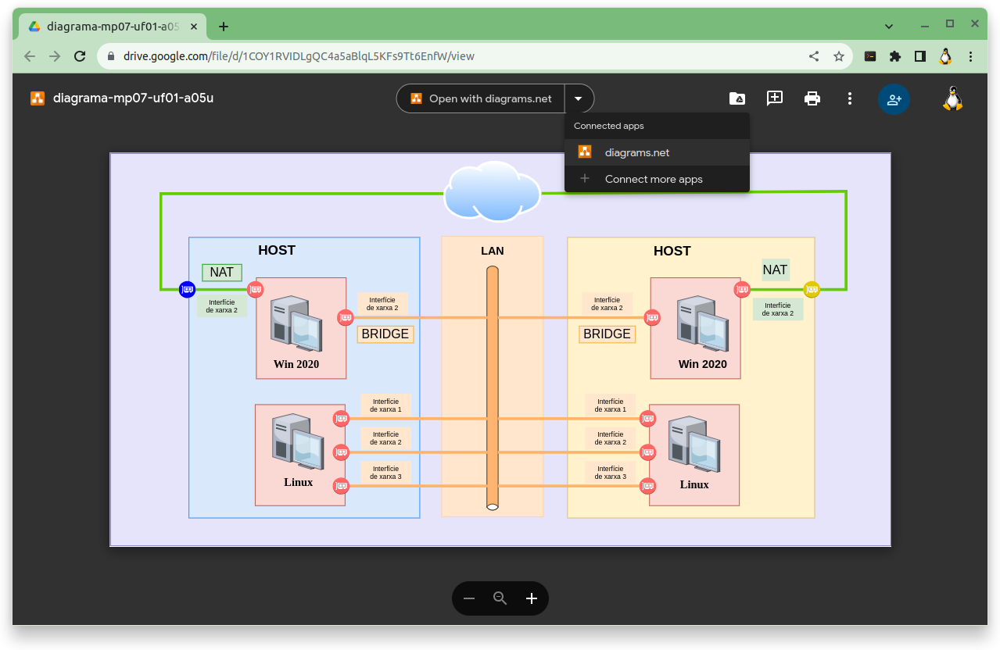
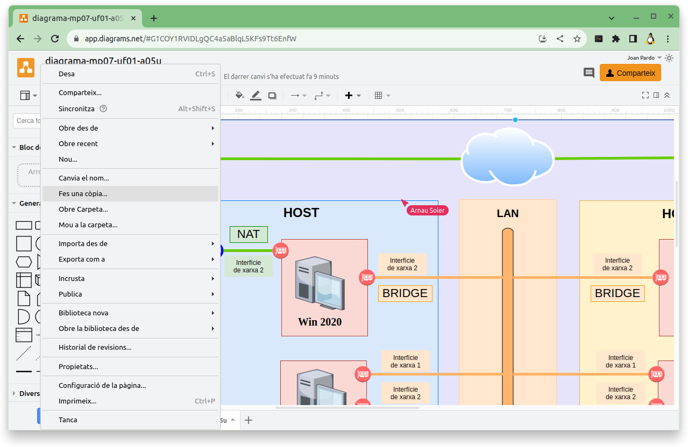
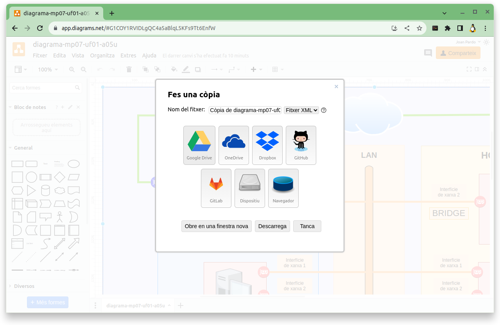

# Configuració per que els servidors es vegin entre ells

<td class="icon">
<div class="title"><h3> :information_source: MP07 UF01 <b>A05U - Activitat 5</b></h3></div>
</td>


## Assignació dels grups

### Grup 1

|Alumne/a|IP Switch|
|---|---|
|Agustí Corbella, Oriol|192.168.100.10 /24|
|Lamela Garcia, Alvaro Haoan|192.168.100.15 /24|
|Román Robles, Àlex|192.168.100.20 /24|
|Soler Sampere, Arnau|192.168.100.25 /24|

### Grup 2

|Alumne/a|IP Switch|
|---|---|
|Boada Cirera, Jan|192.168.100.30 /24|
|Cot Fontanella, Marc|192.168.100.35 /24|
|Putellas Martín, Pol|192.168.100.40 /24|
|Vázquez Pelàez, Alex|192.168.100.45 /24|

### Grup 3

|Alumne/a|IP Switch|
|---|---|
|Navarro Galan, Gerard|192.168.100.50 /24|
|Rueda Guàrdia, Marc|192.168.100.55 /24|
|Sellés Puyol, Aniol|192.168.100.60 /24|

### Grup 4

|Alumne/a|IP Switch|
|---|---|
|Capel Vallbona, Marc|192.168.100.65 /24|
|Codina Garcia, Aleix|192.168.100.70 /24|
|Deus Jurado, Izan|192.168.100.75 /24|
|Ortiz Guerrero, Antoni|192.168.100.80 /24|

### Grup 5

|Alumne/a|IP Switch|
|---|---|
|Pan , Jiahao|192.168.100.85 /24|
|Pan , Le|192.168.100.90 /24|
|Sacristan Castillo, Marc|192.168.100.95 /24|
|Sardaña Trinh, Marc|192.168.100.100 /24|

### Grup 6

|Alumne/a|IP Switch|
|---|---|
|Córdoba Xandri, Oriol|192.168.100.105 /24|
|Garcia Romero, Arnau|192.168.100.110 /24|
|Puriy Puriy, Nicolas|192.168.100.115 /24|
|Royuela Martín, Oriol|192.168.100.120 /24|

### Grup 7

|Alumne/a|IP Switch|
|---|---|
|Gálvez Comajuan, Marc|192.168.100.125 /24|
|Martinez Segú, Eric|192.168.100.130 /24|
|Moreno Fernández, Nil|192.168.100.135 /24|
|Sohl Brenes, Martin Albert|192.168.100.140 /24|

### Grup 8

|Alumne/a|IP Switch|
|---|---|
|Bollero Ruzafa, Ivan|192.168.100.145 /24|
|Casas Lopez, Raul|192.168.100.150 /24|
|Garcia Fernández, Adrià|192.168.100.155 /24|
|Morales Gonzalez, Jan|192.168.100.160 /24|

Podeu comprovar quina és l'**adreça IP** que us toca configurar al vostre **servidor DNS**, i quin és el vostre grup al següent [enllaç](https://script.google.com/a/macros/ginebro.cat/s/AKfycbwyXcC3_d4qYKO2lxQMkS_GXYfajSFB1BP9CX98d9DAN9s3QCf-jfbAvzj5-1Se8_O9gA/exec)

## Creació del nom del grup

### **Pas 1** Nom del grup pel document **```pdf```**

El **nom** del **grup** contindrà els **cognoms**, (**i només els cognoms, no hi haurà cap nom**), de cadascun dels membres del grup, **ordenats alfabeticament** i en minúscules, separats per guions i desprès de l'últim dels cognoms, un guió, el text **```-a05u```** i el fitxer caldrà que tingui extensió **```pdf```**.

> ## **```<cognomAlumne1>-<cognomAlumne2>-<cognomAlumne3>-<cognomAlumne4>-a05u.pdf```**
>
> on:
>
> **```<cognomAlumne1>```** serà el cognom del primer dels alumnes ordenats alfabèticament,
>
> **```<cognomAlumne2>```** serà el cognom del segon dels alumnes ordenats alfabèticament,
>
> **```<cognomAlumne3>```** serà el cognom del tercer dels alumnes ordenats alfabèticament,
>
> **```<cognomAlumne4>```** serà el cognom del quart dels alumnes ordenats alfabèticament (si n'hi ha).

### Per exemple si els membres del grup son:
 
> 1. **Iván Nieto** 
> 1. **Vladi Bellavista** 
> 1. **Rubén Martinez** 
> 1. **Joan Pardo** 
> 
> El nom del **grup** seria:
> 
> **```bellavista-martinez-nieto-pardo-a05u.pdf```**

## Objectiu

L'objectiu d'aquesta activitat és aconseguir que **TOTS** els servidors de **TOTS** alumnes es vegin entre ells. 

## Diagrama de Xarxa de l'activitat



## Repartició de les tasques

Un cop que estiguin fets els grups caldrà que a cada grup es reparteixi la següent feina:

A continuació us passo un llistat de algunes de les tasques que cal fer:

- Preparar el switch per connectar els servidors del diferents membres del grup.

- Comprovar del servidor de cada membre del grup:
    * que tingui l'interficie de xarxa ben configurada
    * que tingui l'adreça IP corresponent

- Comprovar que **TOTS** els servidors de **TOTS** els companys es veuen entre sí.

## Lliurament

El lliurament de l'activitat serà un document en **format ```pdf```**, amb el nom:

> ## **```<cognomAlumne1>-<cognomAlumne2>-<cognomAlumne3>-<cognomAlumne4>-a05u.pdf```**
>
> on:
>
> **```<cognomAlumne1>```** serà el cognom del primer dels alumnes ordenats alfabèticament,
>
> **```<cognomAlumne2>```** serà el cognom del segon dels alumnes ordenats alfabèticament,
>
> **```<cognomAlumne3>```** serà el cognom del tercer dels alumnes ordenats alfabèticament,
>
> **```<cognomAlumne4>```** serà el cognom del quart dels alumnes ordenats alfabèticament (si n'hi ha).


### En aquest document caldrà quedin reflectits *TOTS* els passos que heu seguit per assolir el que es demana a l'activitat.

És a dir, cal que, de cada pas, hi hagi, com a mínim el següent:

**1.** El **TÍTOL** del pas en qüestió,

**2.** L'**EXPLICACIÓ DETALLADA** de com heu fet aquest pas, i
  
**3.** Una **captura de pantalla**, si considereu que s'escau.

**4.** Diagrama de xarxa del grup.

 * Podeu fer servir el següent diagrama [a05u-diagrama-de-xarxa](https://drive.google.com/file/d/1COY1RVIDLgQC4a5aBlqL5KFs9Tt6EnfW/view?usp=sharing) que us he compartit perquè no comenceu des de zero.


Per fer servir aquest document cal:

**1.** que l'obriu amb **```diagrams.net```** => **```Open with diagrams.net```**.



**2.** Feu una copia



**3.** I guardar la còpia al vostre **```drive```**.



> ## L'**objectiu** del document és que seguint les vostres explicacions sigui possible assolir l'objectiu de l'activitat sense cap problema.
