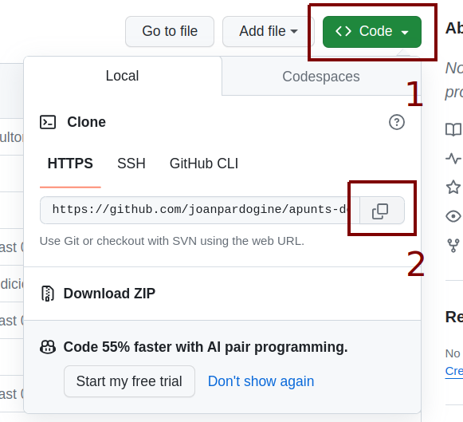
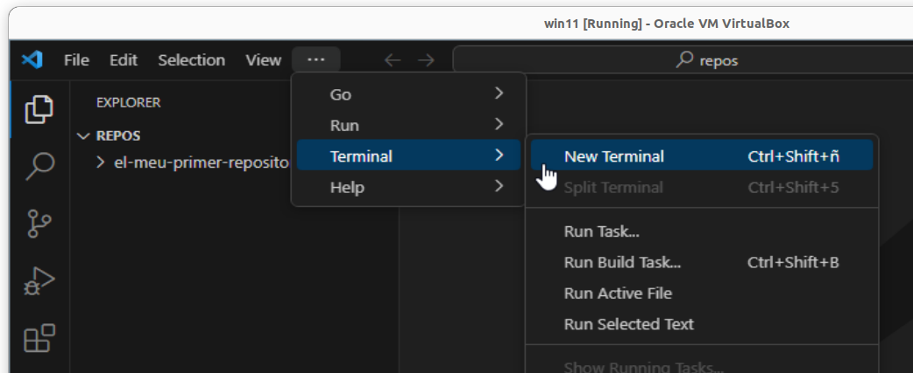
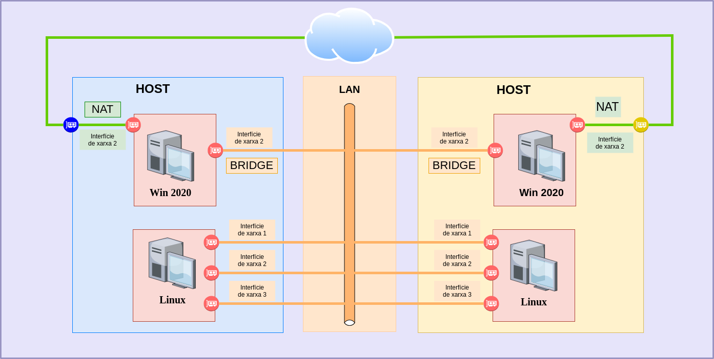
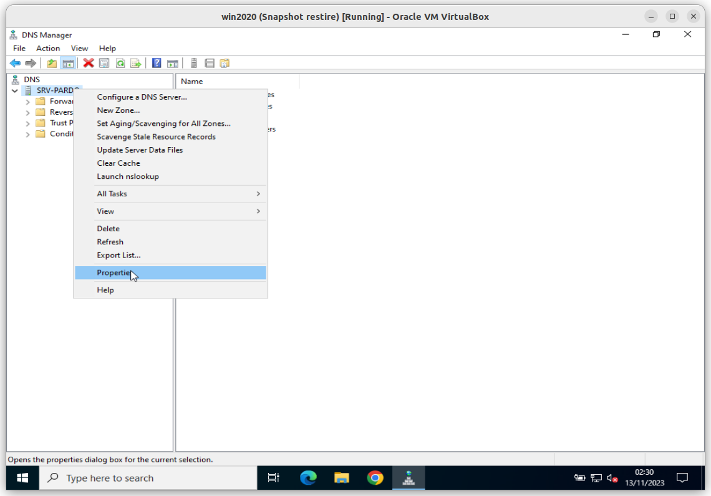
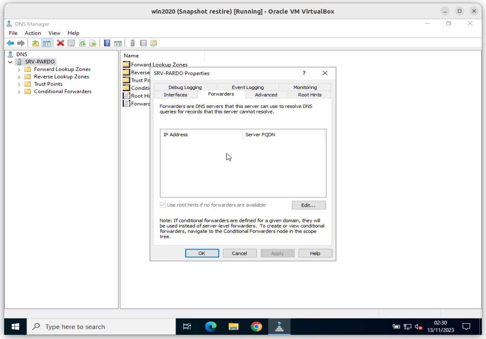

# Configuració de la xarxa classe per que tots els servidors es vegin entre ells

> ## MP07 UF01 A05U - Activitat 5

## Assignació dels grups

|Alumne/a|Grup|
|---|---|
|**Agustí Corbella, Oriol**||
|**Boada Cirera, Jan**||
|**Bollero Ruzafa, Ivan**||
|**Capel Vallbona, Marc**||
|**Casas Lopez, Raul**||
|**Codina Garcia, Aleix**||
|**Córdoba Xandri, Oriol**||
|**Cot Fontanella, Marc**||
|**Deus Jurado, Izan**||
|**Gálvez Comajuan, Marc**||
|**Garcia Fernández, Adrià**||
|**Garcia Romero, Arnau**||
|**Lamela Garcia, Alvaro Haoan**||
|**Martinez Segú, Eric**||
|**Morales Gonzalez, Jan**||
|**Moreno Fernández, Nil**||
|**Navarro Galan, Gerard**||
|**Ortiz Guerrero, Antoni**||
|**Pan , Jiahao**||
|**Pan , Le**||
|**Puriy Puriy, Nicolas**||
|**Putellas Martín, Pol**||
|**Román Robles, Àlex**||
|**Royuela Martín, Oriol**||
|**Rueda Guàrdia, Marc**||
|**Sacristan Castillo, Marc**||
|**Sardaña Trinh, Marc**||
|**Sellés Puyol, Aniol**||
|**Sohl Brenes, Martin Albert**||
|**Soler Sampere, Arnau**||
|**Vázquez Pelàez, Alex**||

Podeu comprovar quina és l'adreça IP que us toca i quin és el vostre grup al següent [enllaç](https://script.google.com/a/macros/ginebro.cat/s/AKfycbySKjryIxHus2ZMggP8_Ap6sOhk0LLgTFgJ2lrKrTZwidQBXYEADZE2vNjofGaXPp0pCw/exec)

## Creació del repositori del grup

### **Pas 1** Nom del **repositori remot** del grup

El **nom** del **repositori del grup** contindrà els **cognoms**, (**i només els cognoms, no hi haurà cap nom**), de cadascun dels membres del grup, **ordenats alfabeticament** i en minúscules, separats per guions i desprès de l'últim dels cognoms, un guió i el text **```-a05u```**.

> ### Per exemple si els membres del grup son:
> 
> 1. **Iván Nieto** 
> 1. **Vladi Bellavista** 
> 1. **Rubén Martinez** 
> 1. **Joan Pardo** 
> 
> El nom del **repositori del grup** seria:
> 
> **```bellavista-martinez-nieto-pardo-a05u```**

### **Pas 2** Creació de la carpeta pel **repositori local**

Cal que **TOTS** els membres del grup crein al seu portatil un **repositori local** a la ruta **```c:\smx2\repos\<cognom1>-<cognom2>-<cognom3>-<cognom4>-a05u```**.

> on:
> **```<cognom1>```** serà el cognom del primer dels alumnes ordenats alfabèticament,
> **```<cognom2>```** serà el cognom del segon dels alumnes ordenats alfabèticament,
> **```<cognom3>```** serà el cognom del tercer dels alumnes ordenats alfabèticament,
> **```<cognom4>```** serà el cognom del quart dels alumnes ordenats alfabèticament (si n'hi ha).

Seguint l'exemple anterior el **repositori local** seria **```c:\smx2\repos\bellavista-martinez-nieto-pardo-a05u```**.

### **Pas 3** Creació del **repositori remot** del grup

**Un dels membres del grup** crearà el **repositori remot** del grup al seu compte de [**github.com**](https://github.com):

* Amb el nom **```<cognom1>-<cognom2>-<cognom3>-<cognom4>-a05u```**
* De **tipus** **```privat```**,
* Sense el fitxer **```README.md```**.

A continuació, i seguint els passos de sembre, vincularà el **repositori remot** del grup amb el seu **repositori local**.

### **Pas 4** Convidar als col·laboradors del **repositori remot**

Un que ja tingui el seu **repositori local** vinculat amb el **repositori remot** del grup:

* convidarà a la resta dels membres i
* convidarà a l'usuari **```joanpardogine```**.

### **Pas 5** Clonació dels col·laboradors del **repositori remot**

**La resta dels membres del grup** clonarà el **repositori remot** del grup amb el **repositori local** del seu portàtil.

Per fer-ho caldrà copiar la URL del **repositori remot** del grup



I a continuació, des de la finestra de terminal de Visual Studio Code,



Cal executar la comanda de git per **clonar** un repositori.

> # ÉS MOLT IMPORTANT QUE AL FINAL DE LA COMANDA HI HAGI, DESPRÉS DE LA URL, UN ESPAI I UN PUNT.

```
git clone <URL> .
```

Un cop ja teniu clonat en el **repositori local** del vostre portàtil, el **repositori remot** del grup.


Ara ja podeu començar a fer l'activitat!


## Objectiu

L'objectiu d'aquesta activitat és aconseguir que **TOTS** els servidors de **TOTS** alumnes es vegin entre ells. 


## Diagrama de Xarxa de l'activitat



## Repartició de les tasques

Un cop que estiguin fets els grups caldrà que a cada grup es reparteixi la següent feina:

A continuació us passo un llistat de algunes de les tasques que cal fer:

- Preparar el switch per connectar els servidors del diferents membres del grup.

- Comprovar del servidor de cada membre del grup:
    * que tingui l'interficie de xarxa ben configurada
    * que tingui l'adreça IP corresponent

- Comprovar que **TOTS** els servidors de **TOTS** els companys es veuen entre sí.

<!-- 
Proposta de configuració del Servidor per Actuar com a **Servidor de DNS Recursiu**

* A la consola DNS, seleccioneu el servidor i feu clic amb el botó dret. Trieu "Propietats".



* Aneu a la pestanya ***Forwarders*** (**Reenviadors**) i marqueu l'opció "Actuar com a servidor DNS".




* A la mateixa pestanya, afegeix les adreces IP dels servidors DNS externs (poden ser els de Google, per exemple: 8.8.8.8 i 8.8.4.4).
 -->
